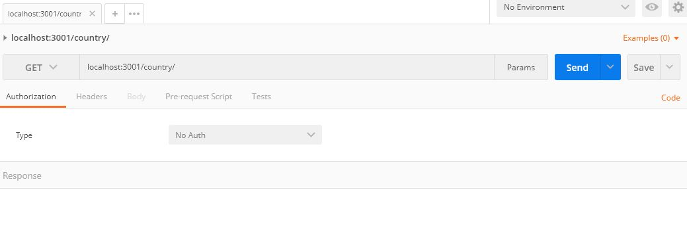
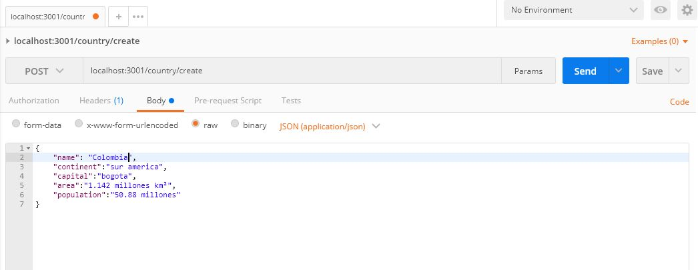
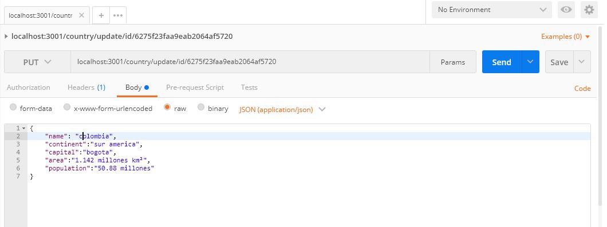
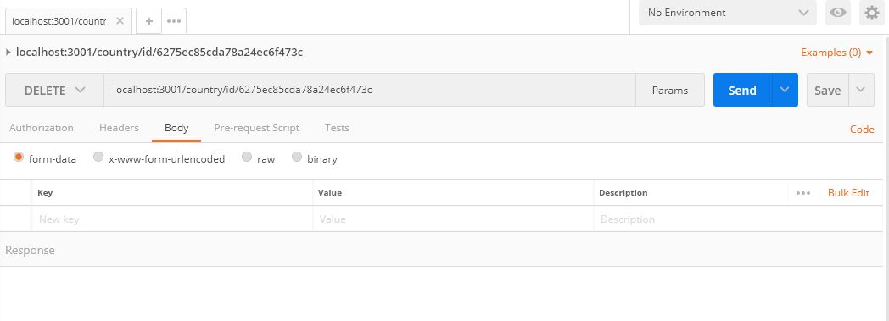
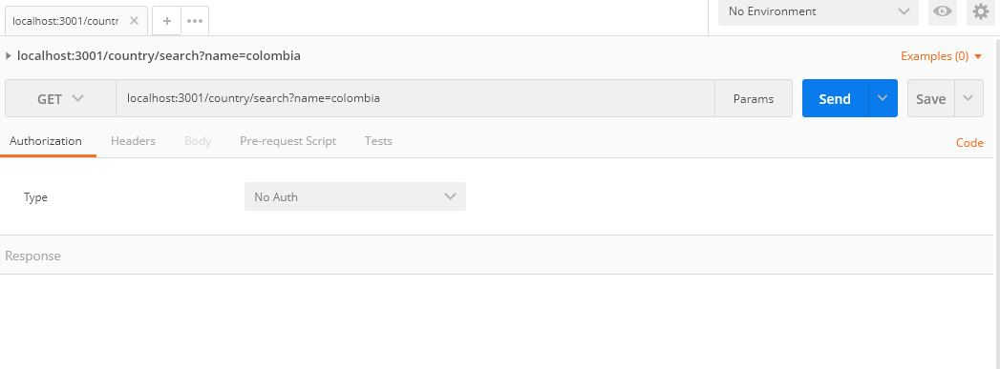
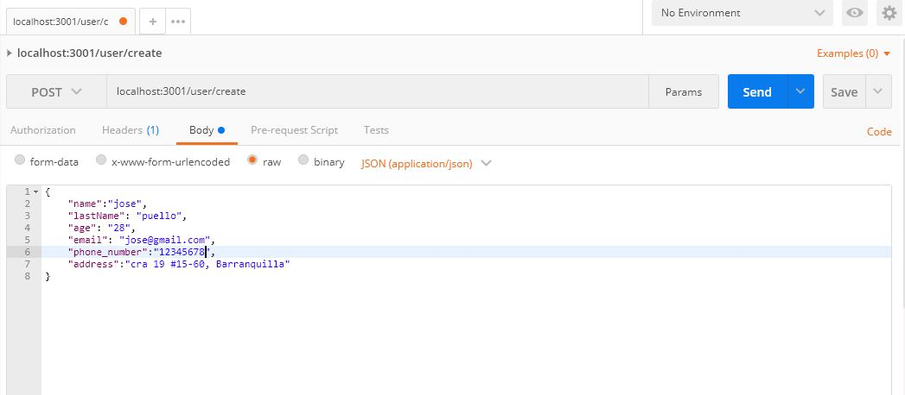
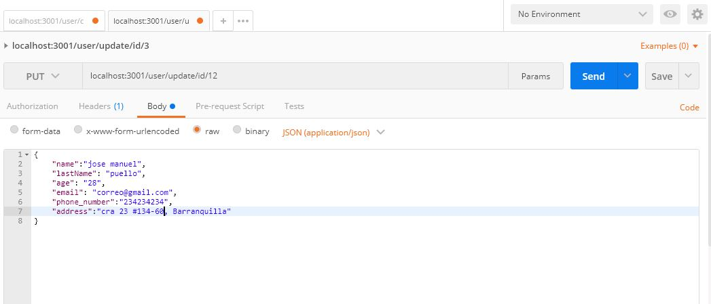
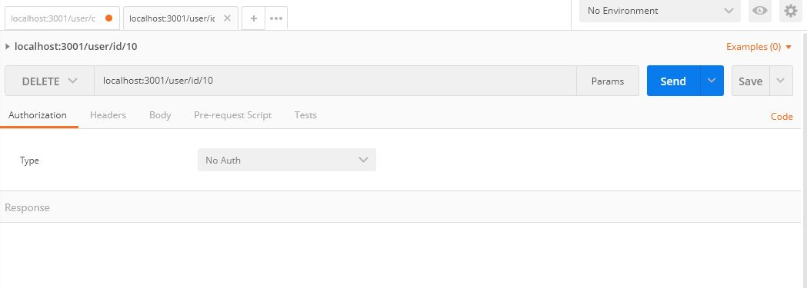
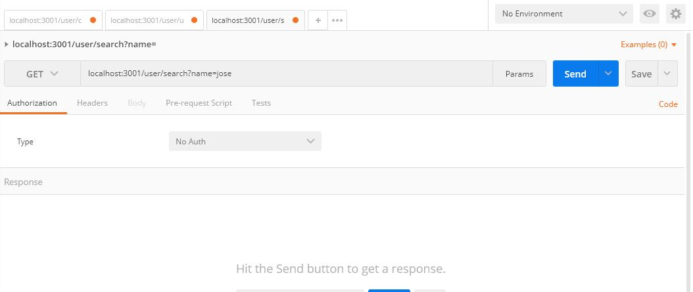
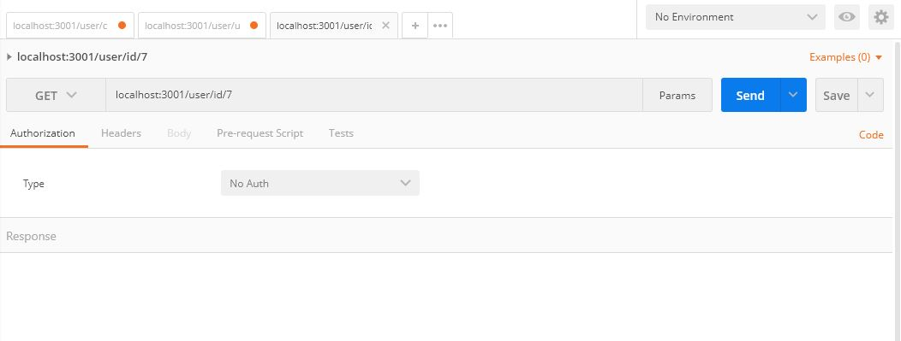

# Prueba 

# BoilerPlate

El boilerPlate cuenta con una cartepa: Api, en esta carpeta estará el código para la prueba back-end.

__IMPORTANTE__: Hacer npm install para instalar todas las dependencias.


En `api` debe crear un archivo llamado `env`:

Configuracion para postgres
```
DB_USER=usuariodepostgres
DB_PASSWORD=passwordDePostgres
DB_HOST=localhost
```
Configuracion para mongodb
```
PORT=puerto
USER=usuarioDeMongo
PASSWORD=passwordDeMongo
```
Completar los datos de `.env` con sus propias credenciales para conectarse a `postgres` y `MongoDB`

# Rutas
<h1>Country</h1>

Country/All
<p align="left">
  
</p>

Country/create
<p align="left">
  
</p>

Country/Update
<p align="left">
  
</p>

Country/Delete
<p align="left">
  
</p>

Country/SearchByName
<p align="left">
  
</p>

Country/SearchById
<p align="left">
  
</p>

<h1>User</h1>

User/All
<p align="left">
  
</p>

User/create
<p align="left">
  
</p>

User/Update
<p align="left">
  
</p>

User/Delete
<p align="left">
  
</p>

User/SearchByName
<p align="left">
  
</p>

User/SearchById
<p align="left">
  
</p>

